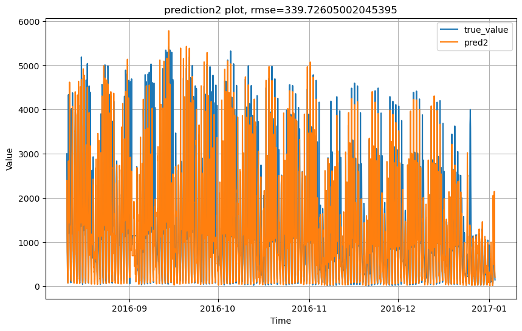

# Laporan Proyek Machine Learning - Gede Wahyu Purnama

## Domain Proyek

</p><p align="justify">
London adalah kota dengan sejarah bersepeda yang panjang. Dalam beberapa tahun terakhir, telah ada minat yang berkembang pada <i>bike-sharing</i> sebagai cara yang berkelanjutan dan nyaman untuk berkeliling kota. Pada tahun 2010, Transport for London (TfL) meluncurkan program <i>bike-sharing</i> Santander Cycles, yang sejak itu menjadi salah satu program <i>bike-sharing</i> paling populer di dunia.
</p><p align="justify">
Salah satu tantangan yang dihadapi program <i>bike-sharing</i>  adalah peramalan permintaan. TfL perlu dapat memprediksi berapa banyak sepeda yang akan dibutuhkan pada waktu yang berbeda dalam sehari dan di lokasi yang berbeda untuk memastikan bahwa ada cukup sepeda yang tersedia bagi pengguna. Jika ada terlalu sedikit sepeda, pengguna akan kecewa dan mungkin kurang mungkin menggunakan program di masa depan. Jika ada terlalu banyak sepeda, TfL akan membuang-buang sumber daya.
</p><p align="justify">
Machine learning dapat digunakan untuk memprediksi permintaan sepeda. Dengan menganalisis data historis penggunaan sepeda, algoritma machine learning dapat belajar untuk mengidentifikasi pola permintaan. Beberapa algoritma yang dapat digunakan yaitu Prophet , XGradientBooster, LSTM dan algoritma time series lainnya. Pada projek ini saya akan menggunakan LSTM dan Deep Neural Network (DNN) dengan menggunakan tool Tensorflow.
</p>

**Reference :**
* [Transport for London (TfL)](tfl.gov.uk)
* [London Bike Share - Prophet, XGB, LSTM🚴‍♀️📈](https://www.kaggle.com/code/ashfakyeafi/london-bike-share-prophet-xgb-lstm)

## Business Understanding


### Problem Statements

Berikut adalah pernyataan masalah yang melatarbelakangi projek ini :
- Bagaimana pola permintaan bike-sharing , apa yang menyebabkan naik-turunnya jumlah permintaan.
- Bagaimana prediksi banyak sepeda yang akan dibutuhkan pada waktu yang berbeda dalam sehari.

### Goals

Berdasarkan pernyataan masalah , adapun tujuan dari projek ini yaitu :
- Melakukan proses Exploration Data Analysis (EDA) untuk menemukan hubungan antar atribut untuk memahami data.
- Membuat model machine learning yang dapat menemukan pola pada data yang akan digunakan untuk memprediksi jumlah permintaan.


### Solution statements
- Membuat model Machine learning dengan algoritma LSTM + DNN yang mencari pola pada data historis atribut-atribut yang berpengaruh pada jumlah permintaan.
- Membuat model Machine learning dengan algoritma LSTM + DNN yang mencari pola pada data historis jumlah permintaan.

## Data Understanding
Dataset yang saya gunakan adalah [London Bike Sharing Dataset | Kaggle](https://www.kaggle.com/datasets/hmavrodiev/london-bike-sharing-dataset). Project ini saya kerjakan menggunakan platform Kaggle dan notebook dari projek saya dapat diakses pada [link ini](https://www.kaggle.com/code/gedewahyupurnama/london-bike-sharing-forecasting-with-tensorflow).

### Variabel-variabel pada London Bike Sharing Dataset adalah sebagai berikut:
```
- "timestamp" - timestamp field for grouping the data
- "cnt" - the count of a new bike shares
- "t1" - real temperature in C
- "t2" - temperature in C "feels like"
- "hum" - humidity in percentage
- "wind_speed" - wind speed in km/h
- "weather_code" - category of the weather
- "is_holiday" - 1 holiday / 0 non holiday
- "is_weekend" - 1 if the day is weekend
- "season" - category field meteorological seasons: 0-spring ; 1-summer; 2-fall; 3-winter.

"weather_code" category description:
  1 = Clear ; mostly clear but have some values with haze/fog/patches of fog/ fog in vicinity 
  2 = scattered clouds / few clouds 
  3 = Broken clouds 
  4 = Cloudy 
  7 = Rain/ light Rain shower/ Light rain 
  10 = rain with thunderstorm 
  26 = snowfall 
  94 = Freezing Fog
```
### Exploration Data Analysis


London Bike Sharing Dataset mencangkup data-data dari tahun 2015 sampai 2016 dan berlokasi di London, UK. Pada awalnya dataset ini terdapat 10 kolom dan 17414 baris dan tidak ada *null values* ataupun data yang terduplikasi. Tetapi setelah saya telusuri lebih dalam ternyata dataset ini masih tidak lengkap, ada *record* yang hilang pada beberapa jam pada suatu hari, bahkan ada yang kosong dalam satu hari penuh.

<div align="center">
<a href='https://www.kaggle.com/code/gedewahyupurnama/london-bike-sharing-forecasting-with-tensorflow?scriptVersionId=137698787&cellId=6'>

</a>
</div>

Saya memutuskan untuk menambahkan record-record yang hilang dan mengisi nilai-nilainya dengan kode seperti berikut 

```python
# adding missing hour
min_datetime = bike_sharing.timestamp.min()
max_datetime = bike_sharing.timestamp.max()
all_datetime = pd.date_range(min_datetime, max_datetime, freq='H')
datetime_df = pd.DataFrame({'timestamp':all_datetime})
new_bike_sharing = pd.merge(datetime_df, bike_sharing, on='timestamp', how='left')

#filling missing value for 9 septenber 2016(the day that totaly have no records)
Sep9 = new_bike_sharing.timestamp.dt.date.astype(str) == '2016-09-02'
# 9 September 2016 is Friday and not a Holiday
new_bike_sharing.loc[Sep9,['is_holiday','is_weekend']] = 0

#filling other missing values
new_bike_sharing.is_holiday.interpolate('pad', inplace=True)
new_bike_sharing.is_weekend.interpolate('pad', inplace=True)
new_bike_sharing.season.interpolate('pad', inplace=True)
values = {
    'cnt':new_bike_sharing.cnt.mean(),
    't1':new_bike_sharing.t1.mean(),
    't2':new_bike_sharing.t2.mean(),
    'hum':new_bike_sharing.hum.mean(),
    'wind_speed':new_bike_sharing.wind_speed.mean(),
    'weather_code':new_bike_sharing.weather_code.mean(),
}
new_bike_sharing.fillna(values,inplace=True)
```
Selanjutnya saya mencari tahu tentang korelasi setiap atribut-atribut terhadap jumlah permintaan (kolom "cnt") dan membandingkan apakah terdapat perbedaan antara dataset lama (terdapat *missing records*) dan dataset yang baru (*missing record* sudah diatasi). Hasilnya , tidak terdapat perbedaan signifikat dari kedua diagram (gambar dibawah). Artribut yang memiliki korelasi tertinggi terhadap jumlah permintaan ialah `hum`, `t1` dan `t2`
</br>
<div align="center">


</div>
</br>
Selanjutnya saya membandingkan penggunaan sepeda pada setiap jam dalam satu hari pada hari-hari kerja dan hari-hari tidak bekerja (libur & akhir pekan). Hasilnya, pada hari kerja penggunaan cenderung lebih banyak pada jam-jam padat yaitu pagi saat berangkat kerja dan sore saat pulang kerja. Sedangkan pada hari tidak bekerja, penggunaan lebih banyak pada jam siang.
</br>
<div align="center">


</div>
</br>

Selanjutnya saya mencari tahu pada musim apa terdapat paling banyak jumlah permintaan sepeda. Hasilnya dapat dilihat bahwa musim panas (*summer*) merupakan musim dengan jumlah permintaan sepeda paling banyak.
<div align="center">

</div>


## Data Preparation
* **Dataset *Train Test Splitting***
  
  ```python
  split = int(len(new_bike_sharing) * .8)
  train_df = new_bike_sharing[:split]
  test_df = new_bike_sharing[split:]
  ```
  Saya melakukan *train test split* data dengan perbandingan 80:20, 80% untuk data training model dan 20% untuk data testing sekaligus cross-validation. Saya melakukan splitting dataset dengan cara men-*slicing* pandas dataframe dari bike sharing dataset (`new_bike_sharing`) yang sudah saya olah sebelumnya.
* ***Windowing Datasets***
  ```python
    def windowed_dataset(self, df, 
                         features, 
                         label=None,  
                         window_size=30, 
                         shift=1, 
                         batch_size=32, 
                         shuffle_buffer=None):
        
        if label is not None:
            dataset_x = tf.data.Dataset.from_tensor_slices(df[features])
            dataset_y = tf.data.Dataset.from_tensor_slices(df[label])
            dataset_x = dataset_x.window(window_size +1 , shift=1, drop_remainder=True)
            dataset_x = dataset_x.flat_map(lambda window: window.batch(window_size+1))
            dataset_x = dataset_x.map(lambda window: window[:-1])
            dataset =  tf.data.Dataset.zip((dataset_x,dataset_y))
        else :
            dataset = tf.data.Dataset.from_tensor_slices(df[features])
            dataset = dataset.window(window_size + 1 , shift=1, drop_remainder=True)
            dataset = dataset.flat_map(lambda window: window.batch(window_size+1))
            dataset = dataset.map(lambda window: (window[:-1],window[-1]))
        
        if shuffle_buffer is not None:
            dataset = dataset.shuffle(shuffle_buffer)
        dataset = dataset.batch(batch_size).prefetch(1)
    
        return dataset
  ```
  Saya melakukan seluruh pre-processing data menggunakan API `tensorflow.data` dan mengubah dataset dari yang awalnya `pandas.DataFrame` menjadi `tensorflow.data.Dataset` supaya pemrosessan seperti *windowing, batching dan shuffle* lebih mudah dilakukan. *Windowed dataset* adalah proses pembagian dataset menjadi *window-window* sejumlah `window_size` dengan pergeseran data dari window `i` ke window `i+1` sebanyak `shift`. Saya melakukan proses ini dengan tujuan untuk menggunakan window-window sebagai x yang akan diinput pada model untuk memprediksi nilai `cnt` yang menjadi y pada kasus ini. Saya menggunakan `window_size = 24` dan `shift = 1` jadi model akan memprediksi nilai y berdasarkan 24 data sebelumnya (24 jam atau sehari pada kasus yang ini). Setelah melakukan *windowing dataset* saya meng-acak data (khusus data training) dan mengelompokan data dalam *batch-batch* sebanyak `batch_size = 64`. Terakhir saya melakukan proses [*prefetching*](https://www.tensorflow.org/guide/data_performance?hl=en#prefetching) menggunakan method `prefetch(1)` pada objek `tensorflow.data.Dataset` yang membantu untuk menyiapkan data pada proses training supaya lebih cepat.
* ***Features Selection***
  ```python
  #dataset for first model
  features = ['t1', 't2', 'hum']
  n_features = len(features)
  series = SeriesDataset(train_df, test_df,features, batch_size=64)
  #dataset for second model
  cnt_train = series.windowed_dataset(train_df,'cnt',window_size=24, batch_size=64)
  cnt_test = series.windowed_dataset(test_df,'cnt',window_size=24, batch_size=64)
  ```
  Pada project ini saya membuat dua model dengan algoritma yang sama tetapi inputnya yang berbeda. Model pertama akan menerima input berupa window-window dari histori features/variable pada 24 jam terakhir yang paling berpengaruh terhadap naik-turunnya jumlah permintaan. Model kedua akan menerima input berupa window-window dari histori jumlah permintaan pada 24 jam terakhir.

## Modeling

<div align="center">


<figcaption> Kanan/Atas : Diagram Model1, Kiri/bawah : Diagram Model2</figcaption>
</div>
<br>

Model saya buat menggunaka API `tensorflow.keras` dengan layer yang saya gunakan pada kedua model adalah Bidirectional-LSTM dan *fully connected dense*. Network arsitektur dari kedua model kurang lebih sama, yaitu menggunakan 1 layer LSTM dengan jumlah unit 64 & aktivasi 'relu', 2 layer Dense dengan jumlah unit 512 & aktivasi 'relu' dan 1 output Dense layer dengan aktifasi 'linear'. Perbedaannya ialah pada model pertama menerima input dengan dimensi `(window_size, n_features)` dan terdapat *Normalization layer* sebelum memasuki layer LSTM sedangkan pada model kedua menerima input dengan dimensi `(window_size, 1)`. Saya menggabungkan dua algoritma (LSTM dan DNN) karena saya rasa satu algoritma LSTM atau DNN saja belum cukup untuk meningkatkan performa model.
```python
model.compile(loss='huber', optimizer='adam',metrics=['mse'])
model.fit( training_dataset,
           callbacks=callbacks,
           epochs=150,
           validation_data=test_dataset
          )
```
Setelah itu saya melakukan proses training kedua model dengan dataset yang sudah disiapkan pada tahap sebelumnya. Kedua model menggunakan [*huber loss function*](https://en.wikipedia.org/wiki/Huber_loss) sebagai fungsi untuk menghitung error pada saat training dan *adam optimizer algorithm* sebagai algoritma yang digunakan untuk pengoptimalan nilai dari loss/error lalu saya mentraining model dengan jumlah iterasi maksimal 150. 
```python
early_stop = tf.keras.callbacks.EarlyStopping(
    ...
)

lr_reduce = tf.keras.callbacks.ReduceLROnPlateau(
  ...
    )

callbacks = [early_stop,lr_reduce]
```
Saya juga menggunakan *callback* yang berguna untuk mengurangi parameter *learning rate* jika training mengalami kondisi yang tidak diinginkan (loss/error meningkat) dan menghentikan proses training jika tidak terjadi perubahan pada setiap iterasi.

## Evaluation

Metrik yang saya gunakan pada saat men-training model yaitu *mean squared error* (MSE). Cara kerja metrik ini adalah menghitung rata-rata dari error yang dikuadratkan, dengan rumus seperti berikut

$$mse = { {\sum (y_i - \hat{y_i})^2} \over n} $$

Lalu pada proses evaluasi saya menggunakan metrik *root mean squared error* (RMSE) yang merupakan akar dari nilai MSE

$$rmse = \sqrt{mse} = \sqrt{ {\sum (y_i - \hat{y_i})^2} \over n} $$

Setelah proses training kedua model selesai, kemudian saya mengevaluasi model-model dengan dataset test yang sudah disiapkan, berikut adalah hasil prediksi dari dataset test dengan menggunakan model-model yang saya buat.

<div align="center">


<figcaption> Kanan/Atas : prediksi dari model pertama, Kiri/bawah : prediksi dari model kedua</figcaption>
</div>

Dari hasil evaluasi, dapat dilihat bahwa performa model pertama masih sangat buruk sedangkan performa model kedua terbilang bagus. Model kedua memiliki nilai rmse sebesar ~340 sedangkan model pertama memiliki nilai rmse ~878